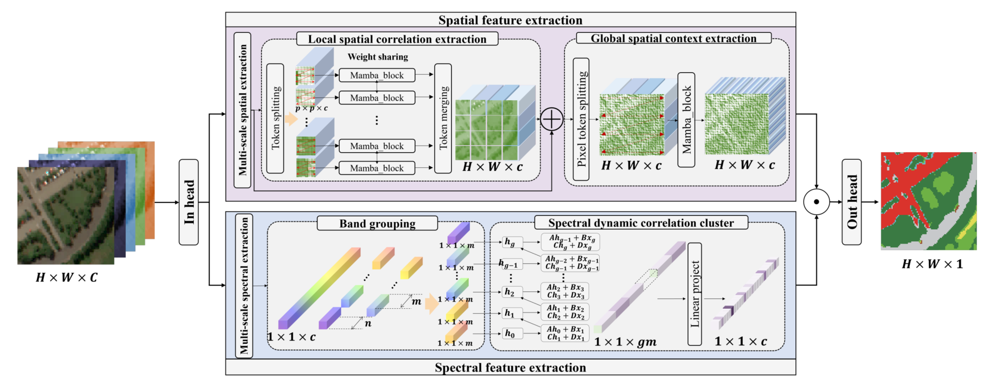

# #YFENG
# QuickStart

### 安装cuda
``` 
wget https://developer.download.nvidia.com/compute/cuda/12.8.1/local_installers/cuda_12.8.1_570.124.06_linux.run
sudo sh cuda_12.8.1_570.124.06_linux.run
```

### 配置cuda环境变量
```
vim /etc/profile
```

文末添加
```
export PATH=/usr/local/cuda-12.8/bin:$PATH
export LD_LIBRARY_PATH=/usr/local/cuda-12.8/lib64:$LD_LIBRARY_PATH
```

### 激活cuda环境变量###

```
source /etc/profile
```

### 创建conda环境
```
conda create -n venv python=3.12
```

### 激活conda环境###
```
conda activate venv
```

### 安装mamba
```
wget https://github.com/state-spaces/mamba/releases/download/v2.2.6.post3/mamba_ssm-2.2.6.post3+cu12torch2.7cxx11abiTRUE-cp312-cp312-linux_x86_64.whl
pip install ./mamba_ssm-2.2.6.post3+cu12torch2.7cxx11abiTRUE-cp312-cp312-linux_x86_64.whl
```
### 安装其他Python库
```
pip install -r requirements.txt
```
### 启动###
```
python main.py
```

# [Hyperspectral Image Classification with Mamba](https://ieeexplore.ieee.org/document/10812905)

Zhaojie Pan, Chenyu Li, Antonio Plaza, Jocelyn Chanussot, and [Danfeng Hong](https://sites.google.com/view/danfeng-hong)

___________

The code in this toolbox implements the Hyperspectral Image Classification with Mamba. More specifically, it is detailed as follow.



Citation
---------------------

**Please kindly cite the papers if this code is useful and helpful for your research.**

Zhaojie Pan, Chenyu Li, Antonio Plaza, Jocelyn Chanussot, and Danfeng Hong. Hyperspectral Image Classification with Mamba, IEEE Transactions on Geoscience and Remote Sensing (TGRS), 2024, DOI: 10.1109/TGRS.2024.3521411.

    @article{pan2024hyperspectral,
      title={Hyperspectral Image Classification with Mamba},
      author={Pan, Zhaojie and Li, Chenyu and Plaza, Antonio and Chanussot, Jocelyn and Hong, Danfeng},
      journal={IEEE Transactions on Geoscience and Remote Sensing}, 
      year={2024},
      note = {DOI: 10.1109/TGRS.2024.3521411}
    }
    
System-specific notes
---------------------
The codes of networks were tested using PyTorch 1.13.1 version (CUDA 11.7) in Python 3.8 on Ubuntu system.

How to use it?
---------------------
Here an example experiment is given by using **Indian Pines hyperspectral data**. Directly run **main.py** functions with different network parameter settings to produce the results. Please note that due to the randomness of the parameter initialization, the experimental results might have slightly different from those reported in the paper.

When executing **main.py**, please take note of the `flag` on line 87 and the `dis` on line 90. When `dis` is set to `True`, the numbers `1`, `2`, and `3` in the `flag` correspond to the **Indian Pines hyperspectral data**, **Pavia University**, and **Houston**, respectively. When `dis` is set to False, the number `1` in the `flag` indicates the **Salinas**.

For other datasets, you can make your own settings in **generate_pic.py**.

Please kindly be careful on assigning arguments such as `num_epochs` on line 114. 

When the dataset is **Indian Pines hyperspectral data** & **Pavia University**, `num_epochs` is set to 1000 and when the dataset is **Houston** & **Salinas**, `num_epochs` is set to 500.

For the datasets of **Pavia University** and **Houston**, you can download the data we use from the following links of google drive or baiduyun:

Google drive: https://drive.google.com/drive/folders/1nRphkwDZ74p-Al_O_X3feR24aRyEaJDY?usp=sharing

Baiduyun: https://pan.baidu.com/s/1ZRmPQYahqvbkMoH_B6v1xw (access code: 29qw)

For the datasets of **Salinas**, you can download the data we use from the following links:

https://www.ehu.eus/ccwintco/index.php?title=Hyperspectral_Remote_Sensing_Scenes

If you encounter the bugs while using this code, please do not hesitate to contact us.

Licensing
---------

Copyright (C) 2021 Danfeng Hong

This program is free software: you can redistribute it and/or modify it under the terms of the GNU General Public License as published by the Free Software Foundation, version 3 of the License.

This program is distributed in the hope that it will be useful, but WITHOUT ANY WARRANTY; without even the implied warranty of MERCHANTABILITY or FITNESS FOR A PARTICULAR PURPOSE. See the GNU General Public License for more details.

You should have received a copy of the GNU General Public License along with this program.

Contact Information:
--------------------

Danfeng Hong: hongdanfeng1989@gmail.com<br>
Danfeng Hong is with the Aerospace Information Research Institute, Chinese Academy of Sciences, 100094 Beijing, China. 

